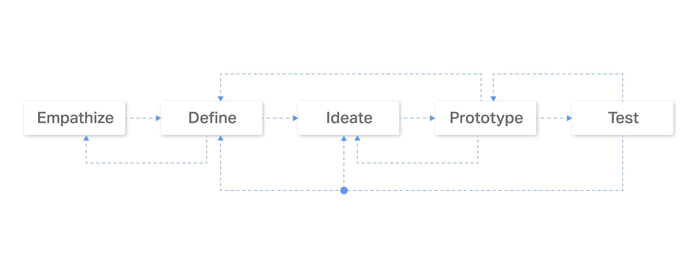
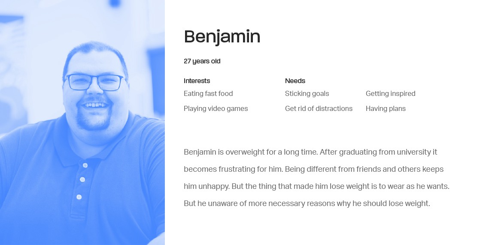
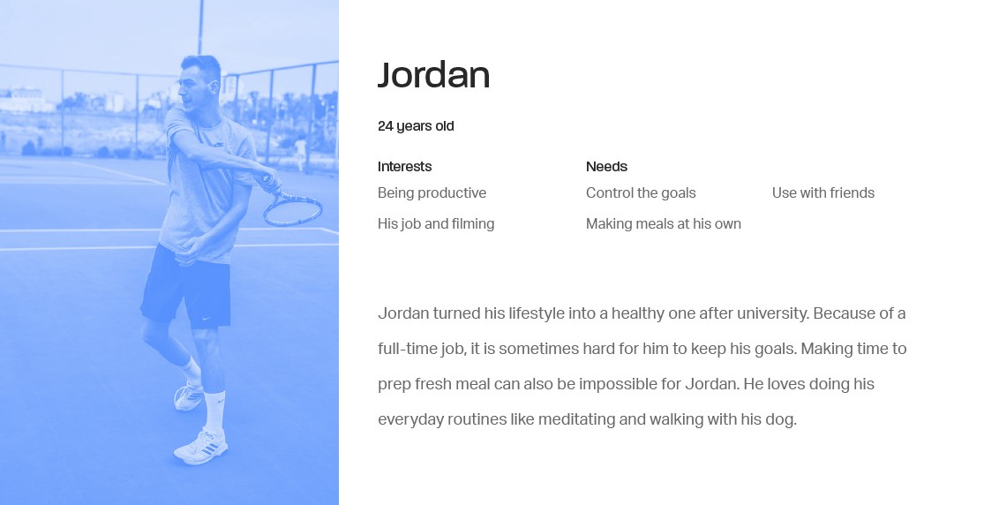
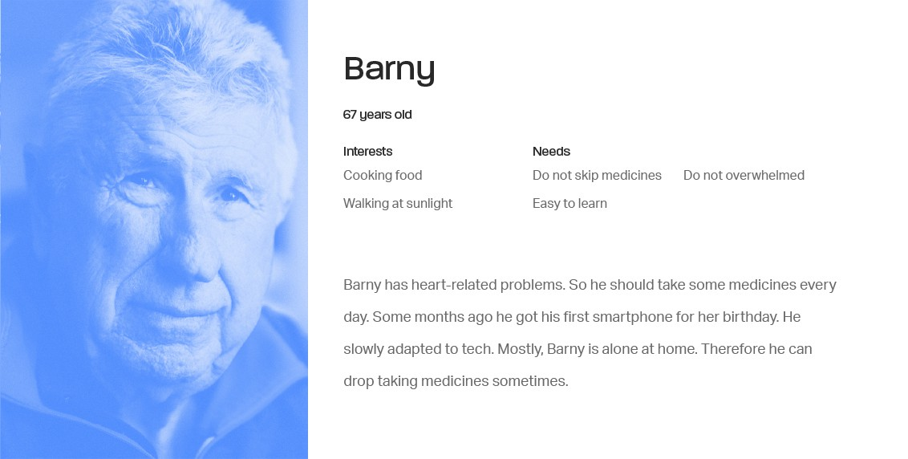
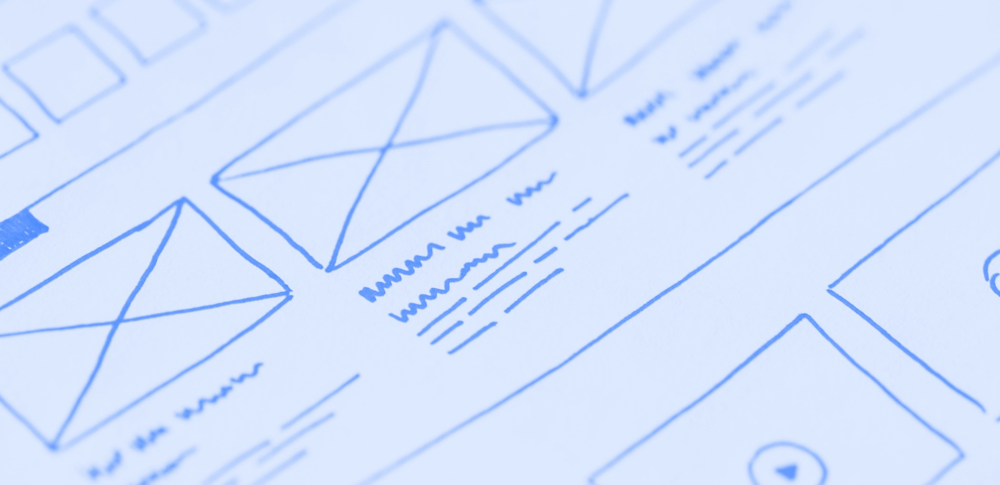
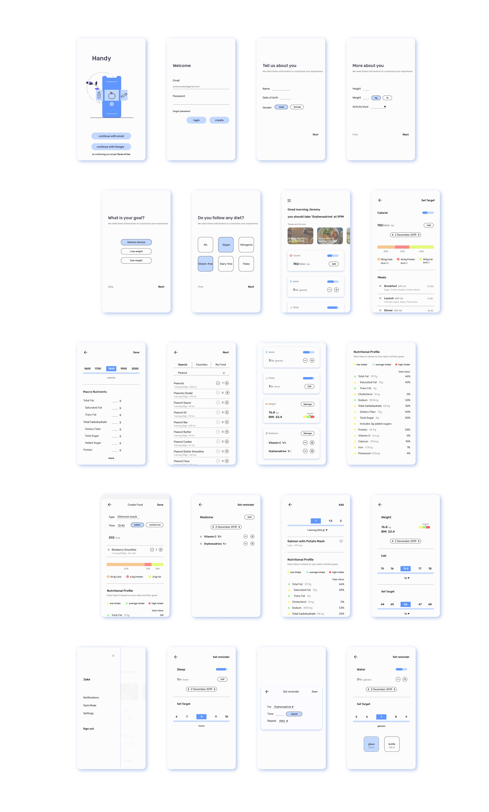
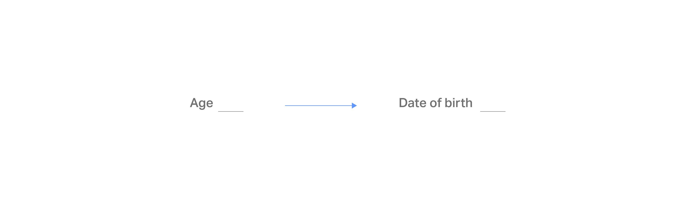
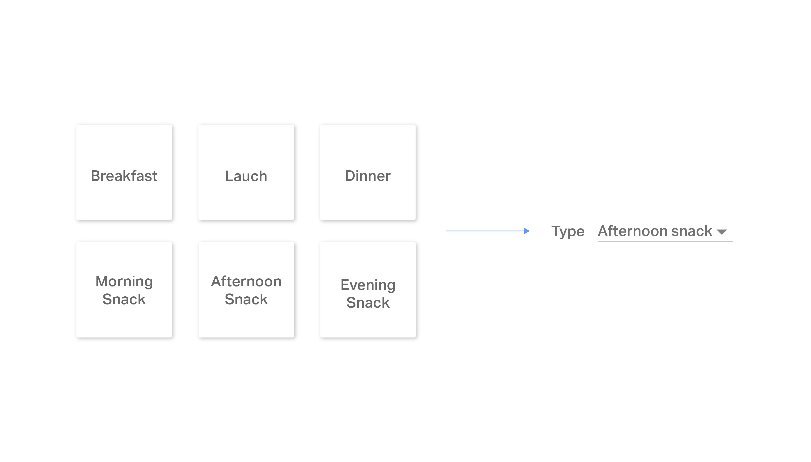
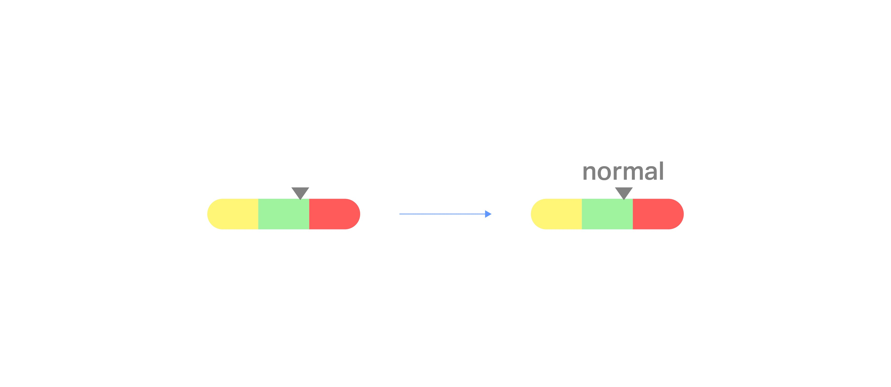

# Handy

***Process***
As a solution, we walked through a classic design thinking process as proposed by The Hasso Plattner Institute of Design at Stanford (d.school).

The process is not linear, that is what makes it easy to use.

***01 Empathize***

_People love eating, especially thin ones._

It can seem though but true that thin persons are much more eager to eat than others — ones have weight problems. It can make the path to come to the emotional impacts of eating. “Emotional eating” can be often heard today. There can be a myriad of reasons behind it. Beyond there are several reasons why people struggle with weight problems. In the end, these problems cause inconsistency in weight loss/gain programs. Also one of the main parts of us that are also affected by them is our belief system. So, goals become failures, even worse, failures without returns.

_The time, you know_

The true story. Even people who eager and can stick to a healthy lifestyle have struggles. Especially, in the busy world of today. It can be hard for one to have something that fits his/her diet plan at the work. So, meals either skipped or cheated. Also the modern gold — time can stop them to make something on their own. So, sticking your wealth — health becomes harder and harder.

_Who are you?_

The world going tech-savvy, so our older generations. Not only the young generation should take their vitamin pills every day to spend on stalking, but the older generation should also be careful about their health. It is common to see that after some age people have some health problems — have medicines. Unfortunately, they can live alone. So, that is why they can skip them — their health. In the long term, this can cause serious problems.

These were the three cases that I used as key points during the process.

***02 Define***

After the empathize phase the key user types are defined as:

1. People who have health, mainly weight problems.
2. People who prefer a healthy lifestyle
3. Old generation (also youngs in some cases) who use medicines

***Defining POVs (Point of View) for each group:***

**Group 1**

1. Understanding the difficulties and suggesting ways to improve willpower.
2. Make the process and progress attractive rather than a goal itself to help users stick goals.
3. Teaching users more about their problems and needs to make them feel more focused and motivated.

**Group 2**

1. Making a healthy lifestyle easy to control.
2. Understanding their programs and routines to assist them.

**Group 3**

1. Give control over routines (about medicines).
2. Easy to learn by any age (as possible).

**What can be done.** _If the project was the real one the POVs can be prioritized by conducting further researches to save the time._

**Personas**

The further process proceeded around these personas.

***03 Ideate***

The ideation phase was about sketching, as it should be. There were “tons” of paper used to understand ideas in the content. This phase also served as a gold mining — insight extracting phase. There were lots of ideas and keys found during the brainstorming session.

The main solution is to bring customized experience due to the users' goals. Suggesting custom articles about their needs we wanted to assist them through their journey. Keeping their activities on track users can feel more controlled and focused on the process.

Through onboarding, we gather the required information for the further calculation and customizations for the users.

Application (for the first iteration) supports:

1. Calorie intake tracking
2. Water intake tracking
3. Sleep tracking
4. Weight control
5. Medicine tracking

Reminders also have a big role in the system to assist users on time.

At this stage, I closely worked with the developer to understand the availabilities of technology and our resources to improve and precise design decisions.

**Wireframes**

***04 Prototype***

Prototyping was completed by adding visuality to the static and monochrome wireframes because the application was not “fancy” from the root. Also, I kept the typography and color scheme on goals — as simple and affordable as possible. Going with a clean and neat UI along with similar typography made the prototyping easy and saved the time.

**Changes through iterations**
After working with the backend developer, we can catch the gap in the requirements. For the long-term use of the product, “age” is not the data we can use later. For the calculations, we will need the current age of users, so I changed “age” to the “date of birth” to keep the current age of users at the system.

I first added “choosing meal-type” features like; breakfast, launch, dinner and etc. But the ongoing process made me understood that there can be more 5 or 6 meals during a day in the life of a person who has weight problems. So, I changed this feature into a more usable one.

During the design process, especially on colors, accessibility made me do some changes to previous decisions. One was the BMI (Body Mass Index) indicator. At the first iteration, it was solely used the color to show BMI range. Then I decided to add more clarity to ease the understanding of the indicator.

**What can be done**
If it was the real project to launch, there were some concepts that should also be included in the process. First of all, research must be done carefully. Because there is no probability to launch any product for users before understanding their deep needs and goals. Understanding is not enough, because we can make mistakes — testing. Without any doubt, any assumption should be tempered with the users before going a reality. Understanding and designing for the whole needs and goals of the users may be a hard but not impossible task to be done.

Readme have been created based on the following medium article:

[Medium article(Case Study)](http://bit.ly/handyappcasestudy)

[App Design](http://bit.ly/handyappdesign)

